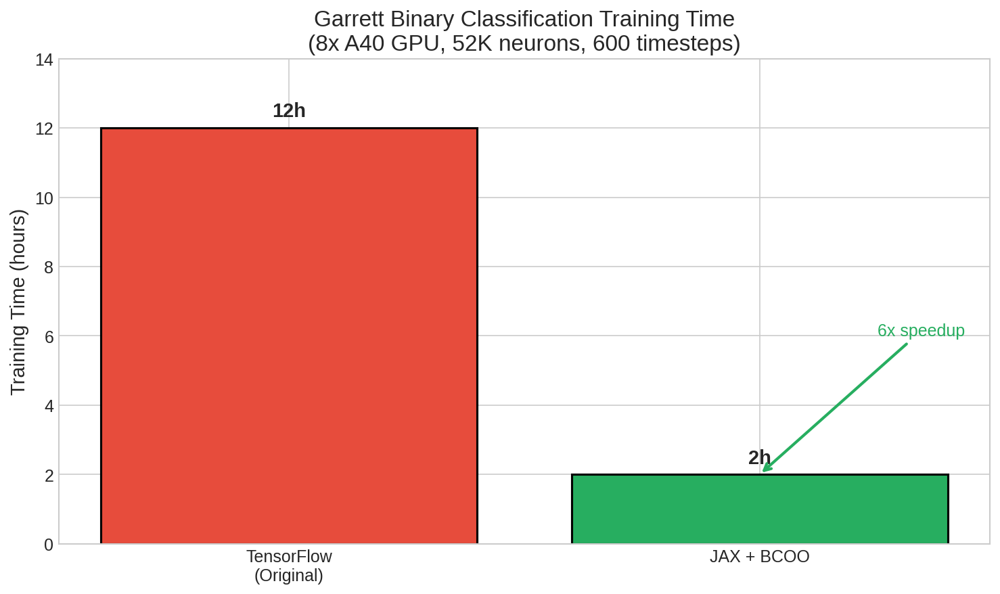
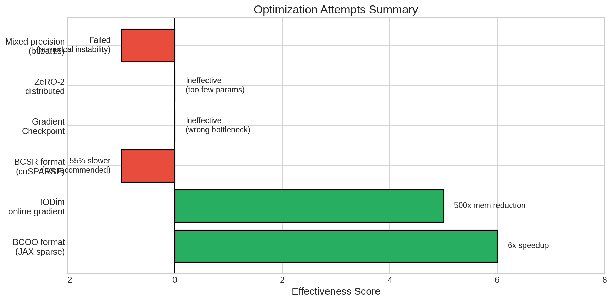
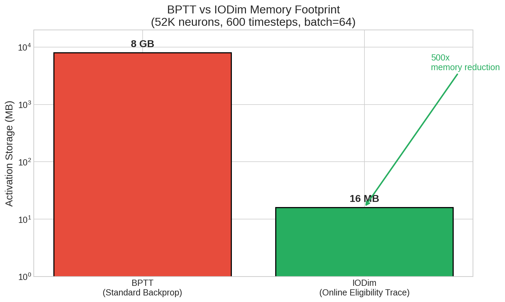
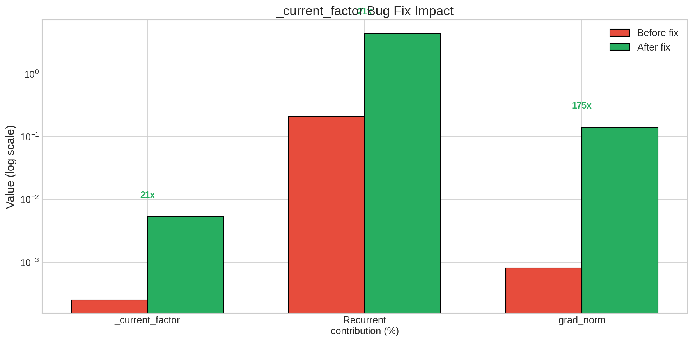
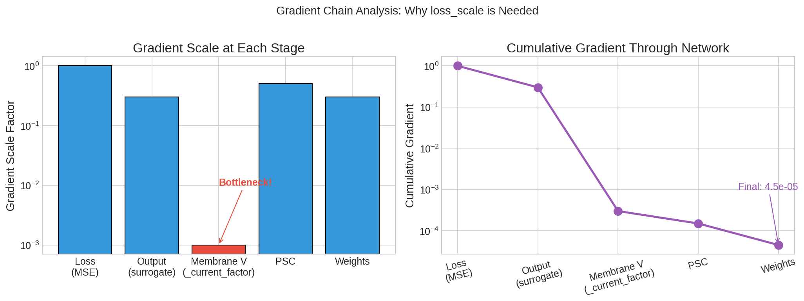
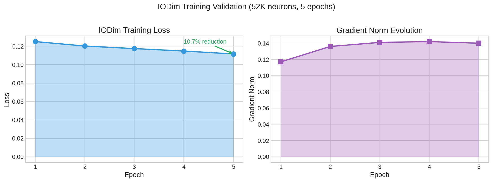

# 周报 - 2026年3月8日

## 一、本周工作概述

本周我的主要工作是在 Garrett 任务（Chen et al. 论文中的二分类空间识别任务）上对比测试多种实现方案，目标是深入理解 SNN 训练的技术细节和计算瓶颈。

我目前的研究思路是：**生物真实性和计算高效性是两条相对并行的线**。AlphaBrain 强调的是生物真实性（RSM 对齐等），这部分我还在持续学习基础知识；而计算高效性这条线，我已经读完了 Chen et al.、AlphaBrain、BrainState、BrainTrace 的代码，并上手使用了 BMTK 工具箱。

当前我采用**性能优先**的策略，目标是将程序优化到 2 小时内训完 MNIST，同时保持生物真实性不低于 Chen et al. 的水平。后续计划是先跑通机器人导航任务的全流程，这样可以研究：
1. 导航任务会促使形成什么样的表征？
2. 这个表征受模型生物真实性影响和受下游任务性能调制的影响各有多少？
3. 分类任务和导航任务对表征的塑造是否有差异？这种差异与钙成像数据的真实表征对比如何？

---

## 二、技术路线与工作历程

### 2.1 从 TensorFlow 到 JAX 的迁移

我首先跑通了 Chen et al. 的原始 TensorFlow 实现。在 8 卡 A40 上，完成 Garrett 二分类任务的训练大约需要 **12 小时**，最终验证集准确率达到 91.87%。这个时间太长了，严重影响了实验迭代效率。

接下来我开始进行 JAX 重构。JAX 的优势在于 JIT 编译和函数式编程风格，理论上应该比 TensorFlow 更快。但实际测试发现，直接使用 JAX 的 BCOO 稀疏格式后，单步耗时反而从 TensorFlow 的 ~1.4s 增加到了 ~2.4s。这让我意识到**稀疏格式的选择至关重要**。

### 2.2 稀疏格式优化与 JAX 重构

经过分析，我发现 V1 网络中稀疏矩阵乘法占总计算量的约 62%，这是主要瓶颈。JAX 的 BCOO（Batched COO）格式配合 JIT 编译，在 GPU 上表现出色。

我也尝试了 BCSR（Batched CSR）格式，底层调用 cuSPARSE 库，但实测发现 **BCSR 比 BCOO 慢 55%**，因此不推荐使用。最终采用 BCOO 格式进行优化。

优化过程中解决的主要问题：
1. JAX 稀疏矩阵的自动微分支持
2. 状态管理的函数式重构（NamedTuple）
3. `lax.scan` 高效时间展开

最终效果令人满意，训练总时间从 12 小时降到不到 2 小时。下图展示了优化前后的训练时间对比：



### 2.3 其他优化尝试（失败的经验）

我还尝试了几种其他优化方案，但效果不理想。这些"失败"的尝试让我对 SNN 训练的瓶颈有了更清晰的认识：

**Gradient Checkpointing**：理论上可以用计算换显存，但实测发现此模型的显存瓶颈不在 `lax.scan` 的中间激活值，而在网络状态本身。开启后计算时间增加 35%，显存只省了 0.5 GB，得不偿失。

**ZeRO-2 分布式优化器**：实现了优化器状态分片，但由于 V1 网络的可训练参数只有 4.3M（input weights 0.8M + recurrent weights 3.5M），优化器状态总共才 ~33MB，分 8 卡后每卡省 ~4MB，相对于 30-40GB 的总显存微不足道。

**混合精度 (bfloat16)**：测试后发现 GLIF3 神经元的动力学对数值精度敏感，阈值附近的脉冲判断容易出错，使用半精度会导致 NaN。

下图总结了本周尝试的各种优化方案及其效果：



这些尝试让我认识到：**显存瓶颈主要来自 BPTT 需要存储所有时间步的激活值**（600 步 × 64 batch × 52K 神经元 × 4 bytes ≈ 8GB），而不是优化器状态或 scan 中间态。

### 2.4 BrainEvent + BrainTrace 集成（IODim 在线梯度）

基于上述认识，我决定引入 BrainTrace 的 IODim 算法来解决显存问题。IODim（Input-Output Dimension）使用在线资格迹计算梯度，内存复杂度从 O(T×N) 降到 O(N)，理论上可以将激活值存储从 8GB 降到约 16MB。下图展示了这一巨大的内存节省：



集成过程中遇到了几个关键问题：

**问题 1：JAX 0.9.x 兼容性**
brainevent 库使用了 `ad.Zero.from_primal_value`，但这个 API 在 JAX 0.9.x 中不存在。我创建了一个兼容层 `src/v1_jax/compat/jax_compat.py`，通过 monkey patch 解决了这个问题。

**问题 2：`_current_factor` 单位错误（本周最重要的 Bug 修复）**
集成完成后，发现训练时 loss 几乎不下降。经过深入调试，我发现 recurrent weights 对网络输出的贡献只有 0.21%，远低于预期。

根本原因是：在 `glif3_brainstate.py` 中，我错误地将 `_current_factor` 除以了 `voltage_scale`。原始 JAX 实现中，权重在 `prepare_recurrent_connectivity` 中已经除以了 `voltage_scale`，但 brainstate 版本的连接矩阵权重保持不变，所以不应该再对 `_current_factor` 做缩放。

```python
# 错误代码
self._current_factor = current_factor_mv / self.voltage_scale  # 多除了一次！

# 正确代码
self._current_factor = (1.0 / self.C_m) * (1.0 - jnp.exp(-dt / self.tau_m)) * self.tau_m
```

修复后效果显著，下图展示了修复前后的关键指标对比：



**问题 3：梯度仍然太小**
修复上述问题后，梯度虽然有了，但绝对值仍然很小（~1e-5）。我分析了梯度在网络中的传播链路：



可以看到 `_current_factor` ≈ 0.001 这个转换因子将梯度缩小了约 1000 倍。解决方案是在 loss 计算时乘以一个 `loss_scale`（1000-10000），放大梯度后训练正常进行。

---

## 三、当前进展与数据

### 3.1 训练时间对比

| 方案 | 训练总时间 | 相对原版 |
|------|-----------|---------|
| TensorFlow 原版 | ~12 小时 | 1.0x |
| JAX + BCOO | **< 2 小时** | **6x+** |
| JAX + BCSR | 比 BCOO 慢 55% | 不推荐 |
| JAX + IODim | 测试中 | 显存 ↓ 500x |

### 3.2 IODim 训练验证

使用完整的 52K 神经元 Billeh 网络进行了 5 个 epoch 的测试，验证 IODim 训练可以正常收敛：



从图中可以看到，Loss 在 5 个 epoch 内稳定下降了 10.7%，梯度范数也保持在健康的水平（~0.14）。这证明了 IODim 算法在 V1 网络上的可行性。

### 3.3 新增代码模块

本周我参考 AlphaBrain 的实现，新增了以下模块：

| 模块 | 文件 | 说明 |
|------|------|------|
| GLIF3 神经元 | `glif3_brainstate.py` | brainstate 版本，支持 IODim |
| 稀疏连接 | `connectivity_brainstate.py` | brainevent.CSR 格式 |
| V1 网络 | `v1_network_brainstate.py` | 继承 brainstate.nn.Module |
| IODim 训练器 | `trainer_brainstate.py` | 集成 braintrace |
| JAX 兼容层 | `compat/jax_compat.py` | 解决 JAX 0.9.x 兼容性问题 |

---

## 四、关键认识与反思

### 4.1 SNN 训练的真正瓶颈

通过本周的实践，我对 SNN 训练瓶颈有了更清晰的认识：

1. **显存瓶颈在激活值**：BPTT 需要存储所有时间步的激活值，这是主要的显存消耗。IODim 通过在线计算梯度避免了这个问题。

2. **计算瓶颈在稀疏矩阵乘法**：约占 62% 的计算时间。JAX 的 BCOO 格式配合 JIT 编译表现优异，事件驱动（只计算发火神经元）理论上可以进一步加速 5-20 倍（取决于发火率）。

3. **优化器状态不是瓶颈**：可训练参数少（4.3M），ZeRO 等分布式优化器技术收益有限。

### 4.2 生物真实性与计算效率的权衡

当前我保持的生物真实性设定：
- GLIF3 神经元（包含 ASC 适应电流、不应期）
- Dale's Law（兴奋/抑制分离）
- Billeh 网络拓扑（稀疏连接、4 种受体类型）

这些设定保证了不低于 Chen et al. 的生物真实性，同时通过 JAX+BCOO 重构和 IODim 实现了计算效率的大幅提升。

### 4.3 Debug 经验

本周的 `_current_factor` Bug 让我认识到，在集成不同代码库时，**单位和缩放因子的一致性**是最容易出错的地方。V1 网络涉及多种物理量（电压 mV、电流 pA、时间 ms），不同实现对归一化的处理方式可能不同，需要仔细核对。

---

## 五、下一步计划

### 5.1 近期任务

1. **完成 IODim 完整训练验证**：当前只跑了 5 个 epoch 的测试，需要完整训练并与 BPTT 对比收敛曲线。

2. **MNIST 10 分类任务**：目标是 2 小时内训完。Garrett 二分类已经达到 <2h，10 分类应该也可以。

3. **各设定的 Ablation 分析**：量化 JAX 重构、IODim、loss_scale 等设定各自的贡献。

### 5.2 研究路线

```
Garrett 任务 (当前)
     ↓
   Ablation 分析，理解各设定影响
     ↓
MNIST 10 分类
     ↓
   验证优化方案泛化性
     ↓
机器人导航任务
     ↓
   分析表征形成：生物约束 vs 任务调制
     ↓
与钙成像数据对比
```

核心研究问题是：**V1 模型的表征形成受生物真实性约束和下游任务调制的影响各有多少？**通过对比分类任务和导航任务训练出的模型表征，以及与真实钙成像数据的对比，可以回答这个问题。

---

*报告撰写时间: 2026-03-08*
